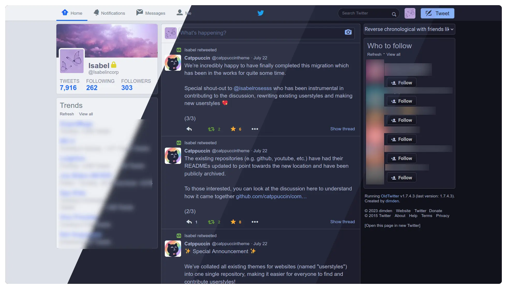
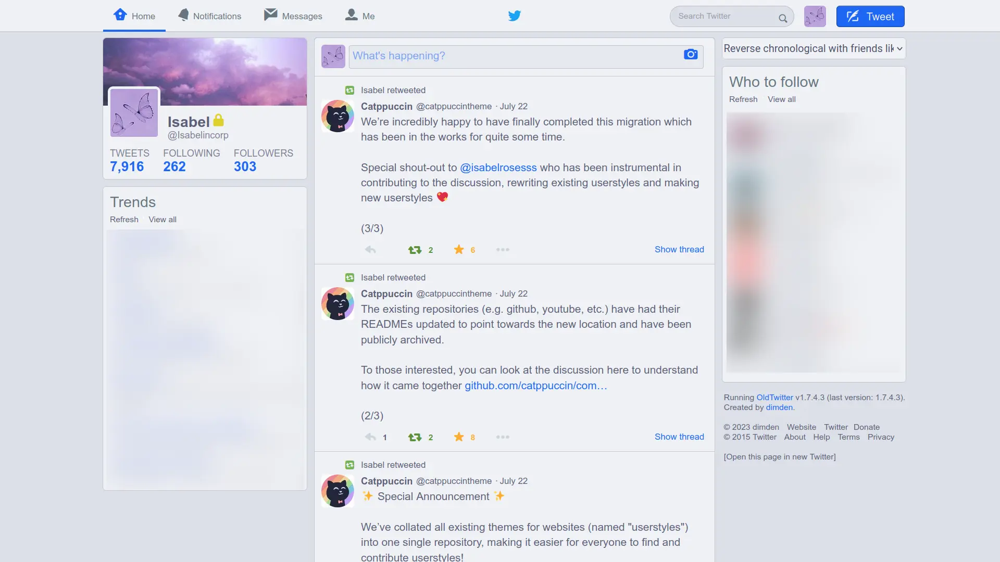
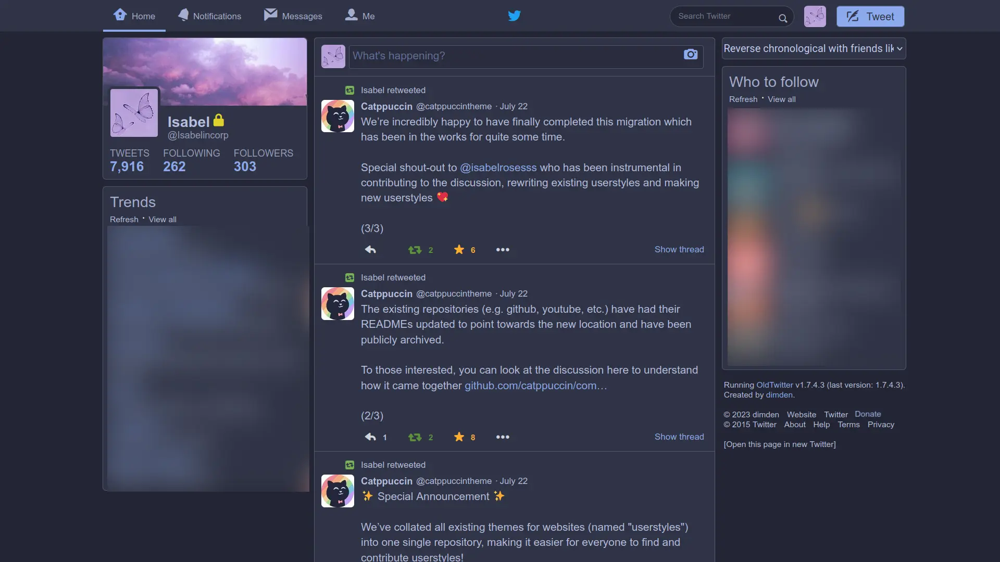
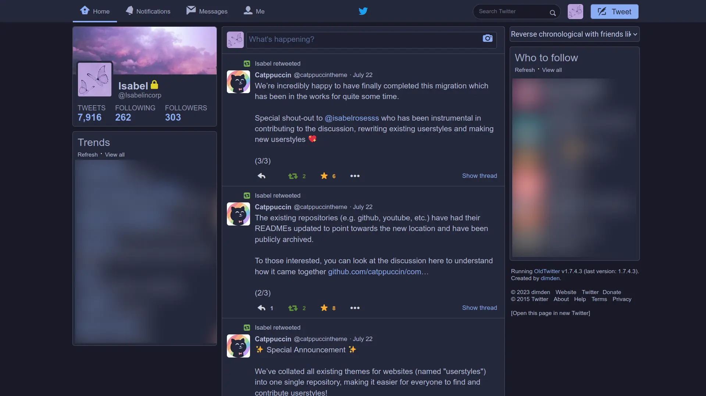
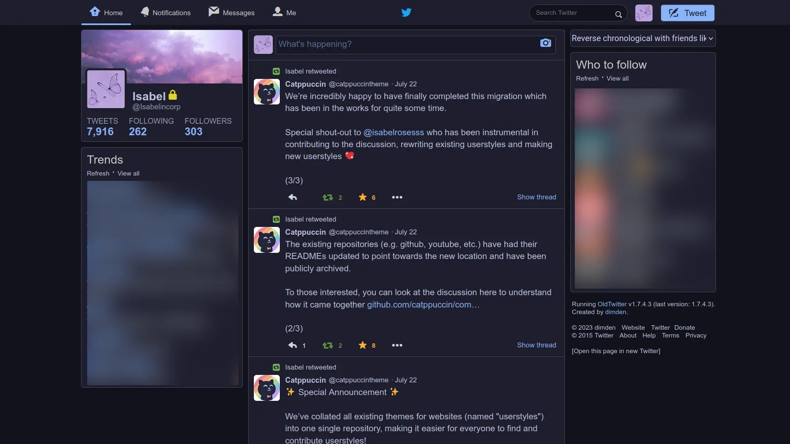

<h3 align="center">
	 
	
	Catppuccin for <a href="https://github.com/dimdenGD/OldTwitter">OldTwitter</a>
	
</h3>

	
	
	

	

## ⚠️ARCHIVED DUE TO THE OLDTWITTER EXTENSTION BEING UNUSABLE⚠️

## Previews

🌻 Latte

🪴 Frappé

🌺 Macchiato

🌿 Mocha

## Usage

1. Clone this repository locally
2. Make sure you have the [OldTwitter Extension](https://github.com/dimdenGD/OldTwitter) installed & enabled
3. On Twitter/X, click your profile icon
4. Go to `Settings`
5. Scroll all the way down to the `Import Style` button 
6. Select it and choose your preferred flavour from the `src` folder
7. Enjoy!

## 🙋 FAQ

-	Q: **_"Why are the colours off?"_**\
	A: Make sure you have dark mode toggled on or off (relative to your selected flavour)
-	Q: **_"Why are the accent colours on some profiles different?"_**\
	A: Currently, this feature isn't working, but, there is a toggle in settings called `Disable profile customizations` that fixes that issue.

## 💝 Thanks to

- [Isabelincorp](https://github.com/isabelincorp)

&nbsp;

	

	Copyright &copy; 2021-present <a href="https://github.com/catppuccin" target="_blank">Catppuccin Org</a>

	

